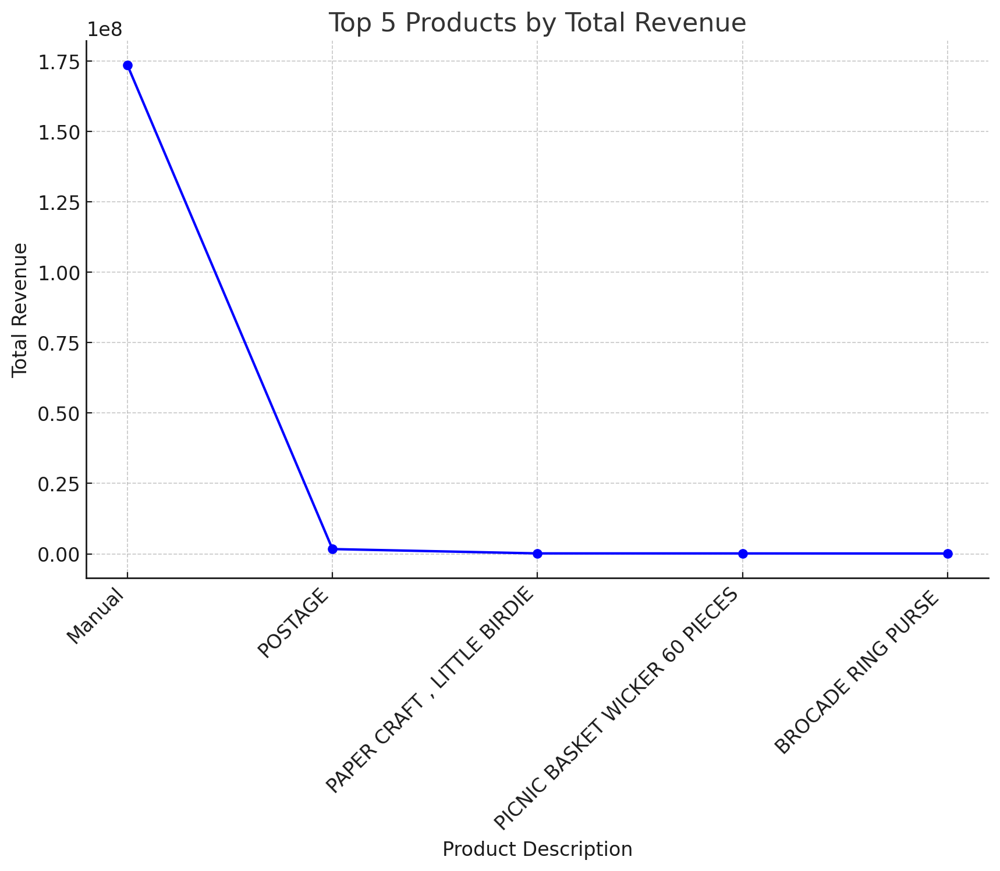
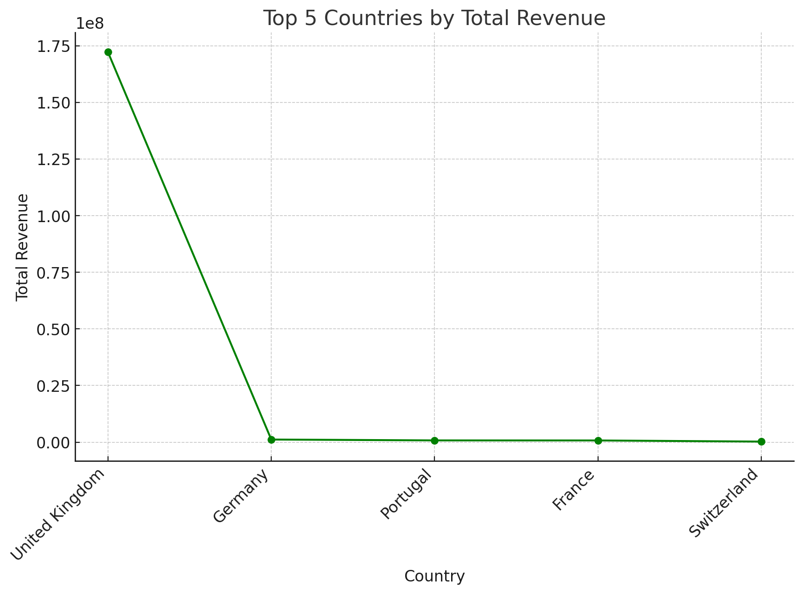
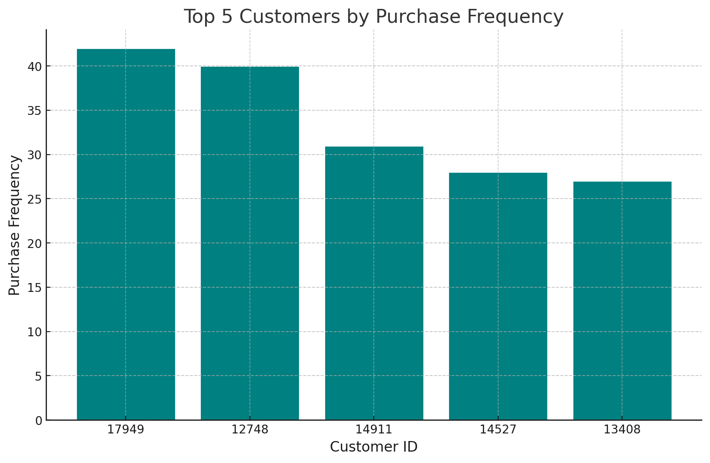
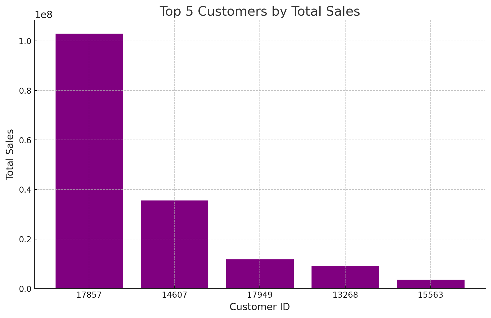

 # E-Commerce Data Analysis with PostgreSQL
## Overview
This project involves analyzing e-commerce transactional data using PostgreSQL. The analysis includes identifying sales trends, top customers, product performance across countries, and customer purchase frequency. The project focuses on SQL-based data cleaning, transformation, and analysis to derive actionable business insights.

SQL queries? Check them out here: [E-commerce Analysis](E_commerce_Analysis) and
[Data Cleaning](Data_Cleaning)


## Dataset
The dataset consists of e-commerce transactions, including fields such as InvoiceNo, StockCode, Description, Quantity, InvoiceDate, UnitPrice, CustomerID, and Country. This data is used to generate insights related to sales performance and customer behavior

#### [Download](.vscode\E_commerce_data.csv) 


## Objectives
- Clean and transform the raw data using SQL to ensure it's suitable for analysis.
- Perform detailed analysis on sales trends, customer behavior, and product performance.
- Provide insights to help guide business strategy and decision-making.


## Technologies Used
- **PostgreSQL**:A powerful, open-source relational database management system used to store, manage, and query the e-commerce data. PostgreSQL was utilized for creating tables, enforcing data integrity through constraints, and performing complex data operations efficiently.

- **SQL**: The structured query language (SQL) was employed for all aspects of data manipulation, including data cleaning, transformation, aggregation, and analysis. SQL queries were used to derive insights from the data, such as identifying sales trends, top customers, and product performance across various countries..
- **Git & GitHub:** Git and GitHub were utilized for version control and collaboration. Git ensured that changes to the project’s code and data analyses were tracked meticulously, while GitHub provided a platform for storing, sharing, and managing the project files, enabling seamless collaboration and iteration throughout the project.

- **VS Code:** VS Code was used as the primary integrated development environment (IDE) for writing and editing SQL queries, as well as managing version control through Git. Its extensions and customization options made it easier to work with different file types and maintain code quality.


# Data Cleaning

### Filtering out outliers
This code identifies and removes invalid entries in the InvoiceDetails and Products tables where Quantity or UnitPrice is less than or equal to zero. These values are generally erroneous, as quantities and prices should be positive. The code ensures data integrity by cleaning up these inconsistent records.

```sql
-- Identify rows with invalid Quantity in InvoiceDetails
SELECT * FROM InvoiceDetails WHERE Quantity <= 0;

-- Identify rows with invalid UnitPrice in Products
SELECT * FROM Products WHERE UnitPrice <= 0;

-- Remove rows with Quantity <= 0 in InvoiceDetails
DELETE FROM InvoiceDetails WHERE Quantity <= 0;

-- Remove rows with UnitPrice <= 0 in Products
DELETE FROM Products WHERE UnitPrice <= 0;
```


### Handling Missing Data
This script checks for missing CustomerID in Invoices and missing Description in Products, then deletes those invalid rows. It also modifies the foreign key constraint on InvoiceDetails to include ON DELETE CASCADE, ensuring related rows are automatically deleted when a row in Invoices is removed.


```sql

-- Check for rows with missing CustomerID in Invoices
SELECT * FROM Invoices WHERE CustomerID IS NULL;

-- Check for rows with missing Description in Products
SELECT * FROM Products WHERE Description IS NULL;


/*If you want to delete the corresponding rows in InvoiceDetails when you delete a row in Invoices,
 you can set up a ON DELETE CASCADE constraint. This way, when a row in Invoices is deleted,
  all related rows in InvoiceDetails are automatically deleted.

First, you need to alter your foreign key constraint:*/

ALTER TABLE InvoiceDetails
DROP CONSTRAINT invoicedetails_invoiceno_fkey;

ALTER TABLE InvoiceDetails
ADD CONSTRAINT invoicedetails_invoiceno_fkey
FOREIGN KEY (InvoiceNo) REFERENCES Invoices(InvoiceNo) 
ON DELETE CASCADE;

--If CustomerID or Description is missing, you might delete those rows

DELETE FROM Invoices WHERE CustomerID IS NULL;
DELETE FROM Products WHERE Description IS NULL;
```

### Referential Integrity

This code removes orphaned records in InvoiceDetails that lack matching InvoiceNo in Invoices or StockCode in Products. After cleaning, it verifies that no orphaned rows remain by checking for InvoiceNo and StockCode discrepancies between InvoiceDetails and their respective parent tables.
```sql
-- Remove orphan Records
-- Remove rows in InvoiceDetails with no matching InvoiceNo in Invoices
DELETE FROM InvoiceDetails
WHERE InvoiceNo NOT IN (SELECT InvoiceNo FROM Invoices);

-- Remove rows in InvoiceDetails with no matching StockCode in Products
DELETE FROM InvoiceDetails
WHERE StockCode NOT IN (SELECT StockCode FROM Products);


----validation and verification


-- Check for any orphaned rows in InvoiceDetails after cleaning
SELECT * FROM InvoiceDetails
WHERE InvoiceNo NOT IN (SELECT InvoiceNo FROM Invoices);

-- Ensure all InvoiceNo in InvoiceDetails exist in Invoices
SELECT * FROM InvoiceDetails
WHERE StockCode NOT IN (SELECT StockCode FROM Products);
```

### Removing Duplicates

This code identifies and removes duplicate rows in the Invoices and Products tables. It first finds potential duplicates by grouping rows with the same InvoiceNo or StockCode, Description, and UnitPrice. It then deletes duplicates by retaining only the row with the smallest ctid (the first physical occurrence), ensuring that each duplicate appears only once in the tables. This process maintains data integrity and uniqueness.

```sql
-- Find potential duplicate rows in Invoices
SELECT InvoiceNo, COUNT(*)
FROM Invoices
GROUP BY InvoiceNo
HAVING COUNT(*) > 1;

-- Find potential duplicate rows in Products
SELECT StockCode, Description, UnitPrice, COUNT(*)
FROM Products
GROUP BY StockCode, Description, UnitPrice
HAVING COUNT(*) > 1;

/*This code removes duplicate rows from the Invoices and Products,
  tables. For each table, it groups rows based on 
unique identifiers (InvoiceNo, StockCode, Description, UnitPrice, Quantity), 
selects the row with the smallest ctid (indicating the first physical occurrence), 
and deletes all other rows with the same identifiers. This process ensures only one 
instance of each duplicate remains in the tables.*/

DELETE FROM Invoices
WHERE ctid NOT IN (
    SELECT MIN(ctid)
    FROM Invoices
    GROUP BY InvoiceNo
);

DELETE FROM Products
WHERE ctid NOT IN (
    SELECT MIN(ctid)
    FROM Products
    GROUP BY StockCode, Description, UnitPrice
);
```

# E_Commerce_Analysis

## 1. Total Sales by Invoice
To get the total sales by invoice, I first joined the InvoiceDetails, Products, and Invoices tables. Then, I calculated the total sales by multiplying the quantity by the unit price for each product, grouped the results by InvoiceNo, and finally ordered the invoices by total sales in descending order.

```sql
--Explanation:
--JOIN InvoiceDetails with Products:

--The query joins the InvoiceDetails table with the Products table on StockCode to access the unit price of each product.
--JOIN InvoiceDetails with Invoices:

--The query then joins InvoiceDetails with the Invoices table on InvoiceNo to group sales by each invoice.
---Calculate Total Sales:

--SUM(id.Quantity * p.UnitPrice) AS TotalSales: This calculates the total sales for each invoice by multiplying the quantity of each product by its unit price and summing these values.
--Group by Invoice Number:

--GROUP BY i.InvoiceNo: Groups the results by each InvoiceNo, so you get the total sales for each invoice.
--Order by Total Sales:

--ORDER BY TotalSales DESC: Orders the results by total sales in descending order, showing the invoices with the highest sales first.


SELECT 
    i.InvoiceNo, 
    SUM(d.Quantity * p.UnitPrice) AS TotalSales
FROM 
    InvoiceDetails d
JOIN 
    Products p ON d.StockCode = p.StockCode
JOIN 
    Invoices i ON d.InvoiceNo = i.InvoiceNo
GROUP BY 
    i.InvoiceNo
ORDER BY 
    TotalSales DESC;
```

 ### Insights from the Data:
- The invoice with InvoiceNo 574277 generated the highest total sales, approximately $103.13 million.
- There is a significant sales drop between the top invoice (InvoiceNo 574277) and others, indicating potential bulk purchases.
- The top 5 invoices together represent a substantial portion of the total sales.


*The bar graph displays the top 10 invoices by total sales. The invoice 574277 stands out with significantly higher sales compared to the others, indicating a major transaction or bulk purchase. The subsequent invoices show a steep decline in sales, highlighting the importance of a few large transactions to the overall revenue. This visualization helps identify key invoices contributing to sales volume*


## 2. Top-selling Products
To find the top-selling products, I joined InvoiceDetails with Products, grouped the results by StockCode and Description, and then calculated total quantity sold, total revenue, and other sales metrics, ordering the results by revenue and quantity sold.

```sql
-Explanation:
--JOIN InvoiceDetails with Products:

--The query joins the InvoiceDetails table with the Products table on StockCode to access the product description and other details.
--Calculate Total Quantity Sold:

--SUM(id.Quantity) AS TotalQuantitySold: This calculates the total quantity sold for each product by summing the quantity values from InvoiceDetails.
--Group by Product Description:

--GROUP BY p.Description: Groups the results by product description so that the total quantity sold is calculated for each unique product.
--Order by Total Quantity Sold:

--ORDER BY TotalQuantitySold DESC: Orders the products by the total quantity sold in descending order, showing the most popular products first.


SELECT 
    p.StockCode, 
    p.Description, 
    SUM(id.Quantity) AS TotalQuantitySold,          -- Total quantity sold of each product
    SUM(id.Quantity * p.UnitPrice) AS TotalRevenue, -- Total revenue generated by each product
    AVG(p.UnitPrice) AS AverageUnitPrice,           -- Average unit price of the product
    COUNT(DISTINCT id.InvoiceNo) AS NumberOfInvoices -- Number of distinct invoices this product appears in
FROM 
    InvoiceDetails id
JOIN 
    Products p ON id.StockCode = p.StockCode
GROUP BY 
    p.StockCode, 
    p.Description
HAVING 
    SUM(id.Quantity) > 0 
ORDER BY 
    TotalRevenue DESC,    
    TotalQuantitySold DESC 
LIMIT 20;                  
```
 ### Insights from the Data:
- **Highest Revenue Product**: The product labeled "Manual" generated the highest revenue, totaling over 173 million, despite only appearing in 58 invoices.
- **Single Invoice High Volume:** The "PAPER CRAFT , LITTLE BIRDIE" product had a high quantity sold (80,995) but appeared in just one invoice.
- **Postage Popularity:** The "POSTAGE" product, despite a relatively lower total quantity sold, appeared in 52 invoices, indicating frequent purchases.




*The line graph shows the total revenue for the top 5 products. The product "Manual" stands out with a significant lead, while the other products show a more gradual increase in revenue. This visualization helps in understanding the relative performance of each product in terms of revenue generation*
## 3. Sales by Country
To analyze sales performance by country, I joined InvoiceDetails with Invoices and Products, grouped by Country, and calculated total quantity sold, total revenue, and the number of invoices. Results were ordered by revenue and quantity sold to identify top-performing countries.

```sql

SELECT 
    i.Country, 
    SUM(id.Quantity) AS TotalQuantitySold,          -- Total quantity of products sold in each country
    SUM(id.Quantity * p.UnitPrice) AS TotalRevenue, -- Total revenue generated from each country
    COUNT(DISTINCT i.InvoiceNo) AS NumberOfInvoices -- Number of distinct invoices per country
FROM 
    InvoiceDetails id
JOIN 
    Invoices i ON id.InvoiceNo = i.InvoiceNo
JOIN 
    Products p ON id.StockCode = p.StockCode
GROUP BY 
    i.Country
HAVING 
    SUM(id.Quantity) > 0 -- Ensure that only countries with sales are included
ORDER BY 
    TotalRevenue DESC,    -- First order by total revenue
    TotalQuantitySold DESC -- Then by total quantity sold;
```

 ## Insights from the Data:
- **Top Market:** The United Kingdom dominates the sales, with the highest total revenue and the greatest number of invoices.
- **Germany's High Revenue:** Despite having fewer invoices, Germany ranks second in revenue, indicating high-value transactions.
- **Lower Quantity, Higher Revenue:** Countries like Portugal and France show that smaller quantities can still generate substantial revenue.




*The line graph illustrates the total revenue generated by the top 5 countries. The United Kingdom is clearly the leader, with a significant gap compared to other countries like Germany and Portugal. This visual highlights the primary markets contributing to overall sales revenue*


## 4. Monthly sales trend

To analyze monthly sales trends, I grouped sales data by month using DATE_TRUNC, summed the total sales for each month, and assigned a sequential MonthNumber using ROW_NUMBER() to order the months chronologically.
```sql
/*
This query calculates monthly total sales and assigns a sequential MonthNumber using ROW_NUMBER().
 The DATE_TRUNC function groups by month, and sales are summed for each month.
  The results are ordered chronologically, giving a numbered
 sequence to each month along with its total sales.*/

   SELECT 
    DATE_TRUNC('month', i.InvoiceDate) AS Month, 
    SUM(d.Quantity * p.UnitPrice) AS TotalSales,
    ROW_NUMBER() OVER (ORDER BY DATE_TRUNC('month', i.InvoiceDate)) AS MonthNumber
FROM 
    InvoiceDetails d
JOIN 
    Invoices i ON d.InvoiceNo = i.InvoiceNo
JOIN 
    Products p ON d.StockCode = p.StockCode
GROUP BY 
    Month
ORDER BY 
```


 ## Insights from the Data:
- **Seasonal Trends:** Sales fluctuate significantly from month to month, with peaks observed in specific months like March and April 2011.
- **Year-End Surge:** December 2010 shows a high sales figure, indicating a potential holiday season boost.
- **Mid-Year Growth:** The data suggests a steady increase in sales from February to April 2011

| Month               | Total Sales       | Month Number |
|:--------------------|------------------:|-------------:|
| 2010-12-01 00:00:00 | 603,047           |            12 |
| 2011-01-01 00:00:00 | 432,602           |            1 |
| 2011-02-01 00:00:00 | 560,830           |            2 |
| 2011-03-01 00:00:00 | 834,926           |            3 |
| 2011-04-01 00:00:00 | 838,571           |            4 |
| 2011-05-01 00:00:00 | 1,114,210         |            5 |
| 2011-06-01 00:00:00 | 339,700           |            6 |
| 2011-07-01 00:00:00 | 1,168,010         |            7 |
| 2011-08-01 00:00:00 | 593,378           |            8 |
| 2011-09-01 00:00:00 | 13,184,900        |           9 |
| 2011-10-01 00:00:00 | 39,587,700        |           10 |
| 2011-11-01 00:00:00 | 117,006,000       |           11 |
| 2011-12-01 00:00:00 | 299,766           |           12 |


## 5. Customer Purchase Frequency
To calculate the purchase frequency for each customer, I counted the distinct invoices associated with each CustomerID, grouped the results by CustomerID, and then ordered them by purchase frequency in descending order.
```sql
/*This query calculates the purchase frequency for each customer by counting 
distinct invoices (InvoiceNo) associated with each CustomerID. The results are
 grouped by CustomerID and ordered by purchase frequency in descending order,
showing how often each customer made a purchase.*/

SELECT 
    i.CustomerID, 
    COUNT(DISTINCT i.InvoiceNo) AS PurchaseFrequency
FROM 
    Invoices i
GROUP BY 
    i.CustomerID
ORDER BY 
    PurchaseFrequency DESC;
```

### Insights from the Data:
- **Top Customer:** Customer ID 17949 has the highest purchase frequency, making 42 distinct purchases.
- **Frequent Buyers:** Several customers, such as those with IDs 12748 and 14911, are also frequent buyers with purchase counts of 40 and 31, respectively.
- **Loyalty Indicator:** High purchase frequency indicates potential customer loyalty, which could be leveraged for targeted marketing.





*This bar graph displays the purchase frequency of the top 5 customers. The customer with ID 17949 stands out with the highest number of purchases, followed closely by other loyal customers. The graph visually highlights the most frequent buyers, which can be valuable for understanding customer behavior and tailoring marketing efforts*


## 6. Top Customers by sale
To calculate total sales for each customer, I summed the product of Quantity and UnitPrice, grouped the results by CustomerID, and ordered them by TotalSales in descending order to identify the top customers by sales.

```sql
/*This query calculates total sales for each customer by summing the product of Quantity and UnitPrice. 
The results are grouped by CustomerID and ordered by TotalSales in descending order, 
showing the top customers by sales.
 Adjust the LIMIT clause to display the desired number of top customers.*/

 SELECT 
    i.CustomerID, 
    SUM(d.Quantity * p.UnitPrice) AS TotalSales
FROM 
    InvoiceDetails d
JOIN 
    Invoices i ON d.InvoiceNo = i.InvoiceNo
JOIN 
    Products p ON d.StockCode = p.StockCode
GROUP BY 
    i.CustomerID
ORDER BY 
    TotalSales DESC
LIMIT 25;  
```
 ### Insights from the Data:
- **Highest Sales:** Customer ID 17857 generated the highest sales, totaling over 103 million, far exceeding other customers.
- **Significant Revenue:** Customers 14607 and 17949 are also major contributors, with total sales of 35.7 million and 11.9 million, respectively.
- **Top 25 Impact:** The top 25 customers collectively represent a significant portion of overall sales, highlighting key revenue drivers.




*This bar graph showcases the total sales generated by the top 5 customers. Customer ID 17857 is the clear leader, with sales exceeding 103 million, followed by other significant contributors like 14607 and 17949. This visual representation highlights the importance of these key customers in driving revenue, making them essential targets for retention strategies*

## 7. Product performance by country
To evaluate product performance by country, I summed total sales (quantity multiplied by unit price) for each product within each country. The results were grouped by Country, StockCode, and Description, and then ordered by country and total sales in descending order.


```sql
/*This query calculates product performance by country, summing total 
sales (quantity times unit price) for each product in each country. 
The results are grouped by Country, StockCode, and Description, then ordered
 by country and total sales in descending order, showing the performance
 of each product in different countries.*/

 SELECT 
    i.Country, 
    p.StockCode, 
    p.Description, 
    SUM(d.Quantity * p.UnitPrice) AS TotalSales
FROM 
    InvoiceDetails d
JOIN 
    Invoices i ON d.InvoiceNo = i.InvoiceNo
JOIN 
    Products p ON d.StockCode = p.StockCode
GROUP BY 
    i.Country, p.StockCode, p.Description
ORDER BY 
    i.Country, TotalSales DESC;
```

### Insights from the Data:
- **Top Product in Australia:** The "POSTAGE" product leads in sales within Australia, generating over 12,000 in total sales.
- **Diverse Product Demand:** Products such as "SET OF 6 SPICE TINS PANTRY DESIGN" and "BLACK RECORD COVER FRAME" also perform well, indicating varied consumer preferences in different countries.
- **Targeted Marketing Opportunities:** Understanding which products perform best in specific countries can help tailor marketing and inventory strategies.


| Country   | StockCode   | Description                       | Total Sales  |
|:----------|:------------|:----------------------------------|-------------:|
| Australia | POST        | POSTAGE                           |     12,714.60 |
| Australia | 22722       | SET OF 6 SPICE TINS PANTRY DESIGN |      1,776.00 |
| Australia | 21137       | BLACK RECORD COVER FRAME          |      1,370.88 |
| Australia | 23084       | RABBIT NIGHT LIGHT                |      1,329.60 |
| Australia | 23247       | BISCUIT TIN 50'S CHRISTMAS        |      1,162.08 |


*This table provides a clear overview of the top-performing products in Australia, including their total sales,*

# What I Learned
In this project, I learned how to analyze sales data across different dimensions, such as customer behavior, product performance, and geographical trends. I developed SQL queries to extract meaningful insights by joining multiple tables, aggregating data, and organizing results. Through this process, I gained a deeper understanding of:

**1.Customer Purchase Behavior**: By calculating purchase frequency and total sales per customer, I identified key customers who contribute significantly to overall revenue, highlighting opportunities for targeted marketing and retention strategies.

**2.Product Performance Analysis**: Analyzing product sales in various countries allowed me to understand which products perform best in specific regions. This information can inform inventory management and localized marketing efforts to maximize sales.

**3.Monthly Sales Trends:** Tracking sales trends over time revealed seasonal patterns and peak sales periods, which are crucial for planning marketing campaigns, promotions, and inventory levels.

**4.Data Visualization:** I improved my skills in creating various types of visualizations, such as bar graphs, line charts, and pie charts, to effectively communicate the insights derived from the data.


# Conclusion
The project provided valuable insights into sales data, highlighting the importance of understanding customer behavior, product performance, and seasonal trends. By leveraging SQL for data analysis and visualization tools to present findings, I could draw actionable conclusions that can help businesses optimize their strategies for customer engagement, inventory management, and sales growth.

## Final Insights from the Project Analysis
From the detailed analysis of sales data, several key insights emerged, each offering valuable guidance for business strategy and operations:

**1.Customer Segmentation and Value:**

The analysis revealed that a small group of high-frequency buyers contributes significantly to total revenue. For example, Customer ID 17857 alone generated over 103 million in sales, far outpacing other customers. This highlights the importance of focusing on high-value customers through personalized marketing and loyalty programs to maximize lifetime value.

**2.Regional Product Performance:**

Product performance varies significantly by region, with certain products performing exceptionally well in specific countries. For instance, in Australia, "POSTAGE" was the top-selling product, indicating a strong regional demand. This suggests that tailoring product offerings and marketing strategies to the preferences of local markets can lead to better sales performance and customer satisfaction.

**3.Seasonal and Monthly Sales Trends:**

The analysis of monthly sales trends showed clear seasonal patterns, with notable peaks during certain months, such as December 2010 and April 2011. Understanding these patterns allows businesses to optimize inventory levels, prepare for high-demand periods, and launch timely promotional campaigns to capitalize on increased consumer spending.

**4.Product Diversification:**

The diversity in top-selling products across different regions and months indicates the value of maintaining a broad product portfolio. This helps in catering to varied customer preferences and mitigating risks associated with over-reliance on a single product or market.

**5.Market-Specific Strategies:**

The insights underscore the need for market-specific strategies, such as focusing on best-selling products in key regions and addressing underperforming products through targeted promotions or adjustments in pricing. By aligning marketing efforts with regional demand, businesses can enhance their competitive edge in each market.

## Final Thoughts
The analysis has provided actionable insights that can drive more effective business strategies. By leveraging customer segmentation, understanding regional preferences, and recognizing seasonal trends, businesses can improve their targeting, optimize inventory, and ultimately increase sales and profitability. The findings from this project highlight the critical role of data-driven decision-making in achieving sustainable business growth.

